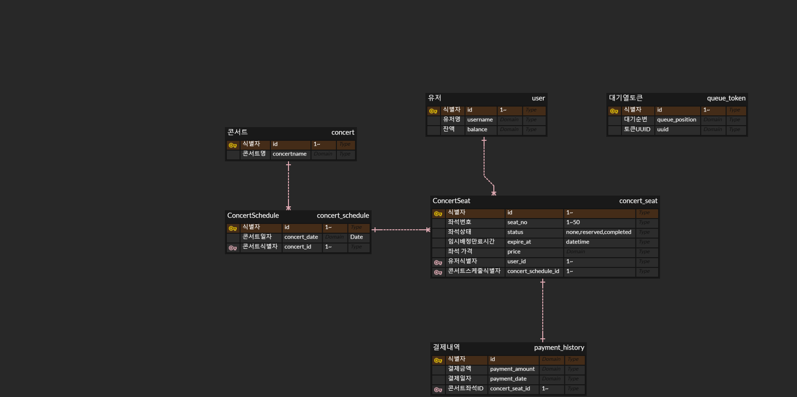

## 콘서트 예약 서비스

## Getting Started

### Prerequisites

#### Running Docker Containers

`local` profile 로 실행하기 위하여 인프라가 설정되어 있는 Docker 컨테이너를 실행해주셔야 합니다.

```bash
docker-compose up -d
```

### 프로젝트 마일스톤
<a href="https://babyslayerr.github.io/hhplus-week3/mileStone.pdf">
    <h3>프로젝트 마일스톤</h3>
</a>


### 시퀀스 다이어그램  
<a href="https://babyslayerr.github.io/hhplus-week3/sequence_diagram.html">
    <h3>시퀀스 다이어그램</h3>
</a>


### ERD
<a href="https://babyslayerr.github.io/hhplus-week3/ERD.png">
    
</a>

### API 명세서
<a href="https://babyslayerr.github.io/hhplus-week3/api_specification.md">
    <h3>API 명세서</h3>
</a>


